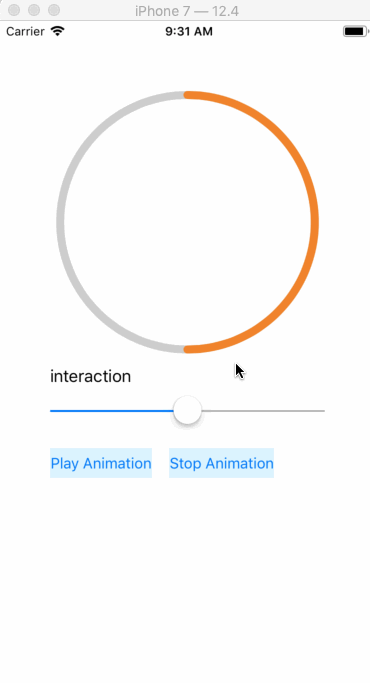
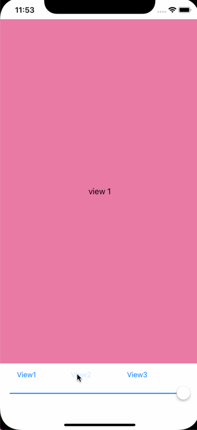
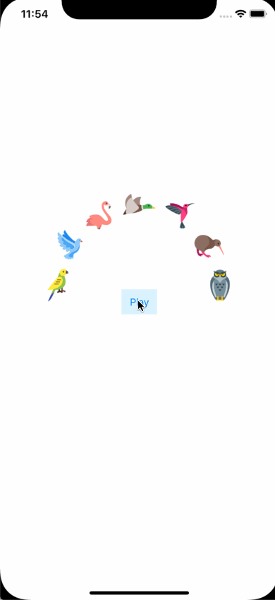
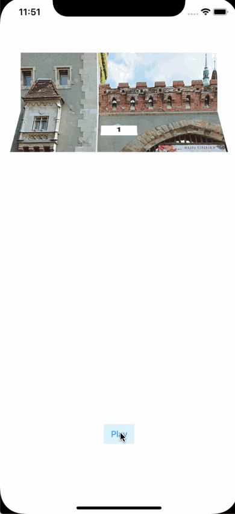
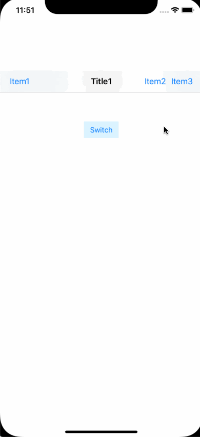

# UIAnimationDemo

## DrawCircleAnimation

* 利用 CAShapeLayer 與 UIBezierPath 來畫圓
* 修改 CAShapeLayer.strokeEnd 來達到控制互動
* 設定 CASpringAnimation 或 CABasicAnimation，加到 layer 裡執行動畫

 
 
 

## MaskAnimation

* 用 CAShapeLayer 畫圓，並設定給 view.layer.mask 來達到遮罩效果
* CAShapeLayer 執行 CABasicAnimation，針對 'transform' 屬性做動畫
* 對 matrix 做 scale，從 0.0 放大到 1.3倍，讓圓可以覆蓋整個 View

 
 
 

## SpinMenu

* CAKeyframeAnimation 執行移動 View 的動畫
* CAAnimationGroup 組合移動 + 晃動的動畫

 
 
 

## FoldingView

* 取得 UIView 的快照內容
* 用多個 layer 來執行 rotate 動畫

 
 
 

## SwitchBar

* 取兩個 NavigationBar 的快照
* 用兩個 layer 做 transform rotate

