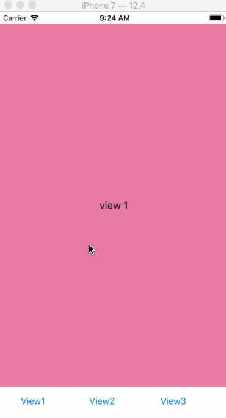

# UIAnimationDemo

### DrawCircleAnimation

* 利用 CAShapeLayer 與 UIBezierPath 來畫圓
* 修改 CAShapeLayer.strokeEnd 來達到控制互動
* 設定 CASpringAnimation 或 CABasicAnimation，加到 layer 裡執行動畫

--

### MaskAnimationDemo

* 用 CAShapeLayer 畫圓，並設定給 view.layer.mask 來達到遮罩效果
* 給 CAShapeLayer 設定 CABasicAnimation，針對 'path' 屬性做動畫
* 初始的 path 是小圓，結束的 path 是大圓